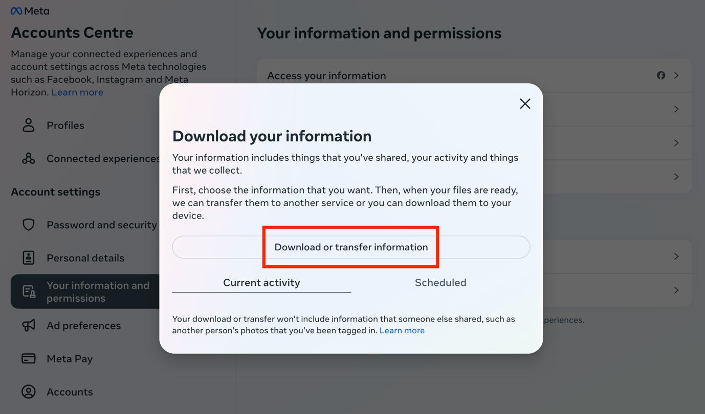
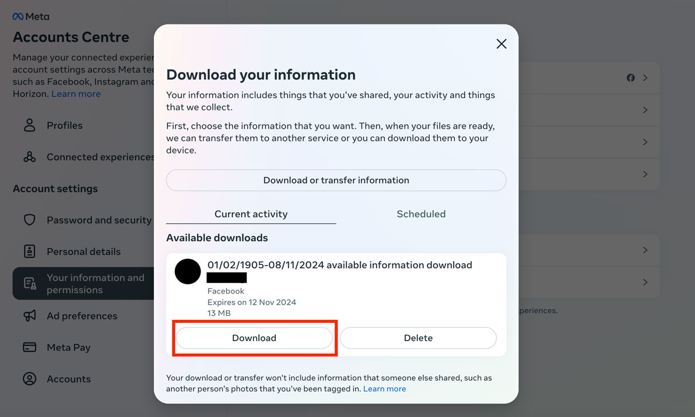

Device: **Browser** \| [iOS App](facebook_ios)

## 1. Log in to Facebook and open your Accounts Center

Open Facebook and log into your account:
[https://www.facebook.com/](https://www.facebook.com/).

Once you sign in, click on the following link to access the Accounts
Center: [https://accountscenter.facebook.com/](https://accountscenter.facebook.com/).

## 2. Click Your information and permissions

Click on **Your information and permissions** on the left panel:
[https://accountscenter.facebook.com/info_and_permissions](https://accountscenter.facebook.com/info_and_permissions)

Then click on **Download your information**.

## 3. Click Download or transfer information

Once you click on Download your information, the following page will
appear:

## 4. Select the amount of information you would like to download

Click on **Available information**.

Once you click on Available information, select **Download to device**.

## 5. Choose your file options

The following will appear to select your file options:

- Select the **Date range**: All time \[_note: Date range can be
  customised_\]
- Select who to **notify**: \[email address\]
- Select the **format**: JSON
- Select the **media quality**: Medium \[_other options: Low/High_\]

Then click on **Create files**.

Once you click on **Create files**, this will appear:

## 6. Check your email for the download link

Meta (`notification@facebookmail.com`) will send you an email with a
download link within 30 minutes. Make sure that you are signed in to
the email you entered in the previous step. If you have not received the
email within a few hours, make sure to check your junk mail folder.

In the email, click **download your information**. You will have to do
this within four days of requesting the information, otherwise you will
have to request a new download.

## 7. Start downloading the information to your device

Once you click on the link above, the following page will appear:

Click on **Download** on the bottom left.

## 8. Locate the downloaded file on your device

The information will be downloaded to your device as a ZIP file and will
be saved on your device in the Downloads folder.
