Device: [Browser](facebook) \| **iOS App**

## 1. Sign in on the Facebook app

Open the Facebook app and sign in to your account.

## 2. Find the Accounts Center

To request the information, you will have to find the Accounts Center,
which is located in the Settings page.

First, click on **Menu** on the bottom right of your screen. Scroll down
and click on **Settings & privacy**.

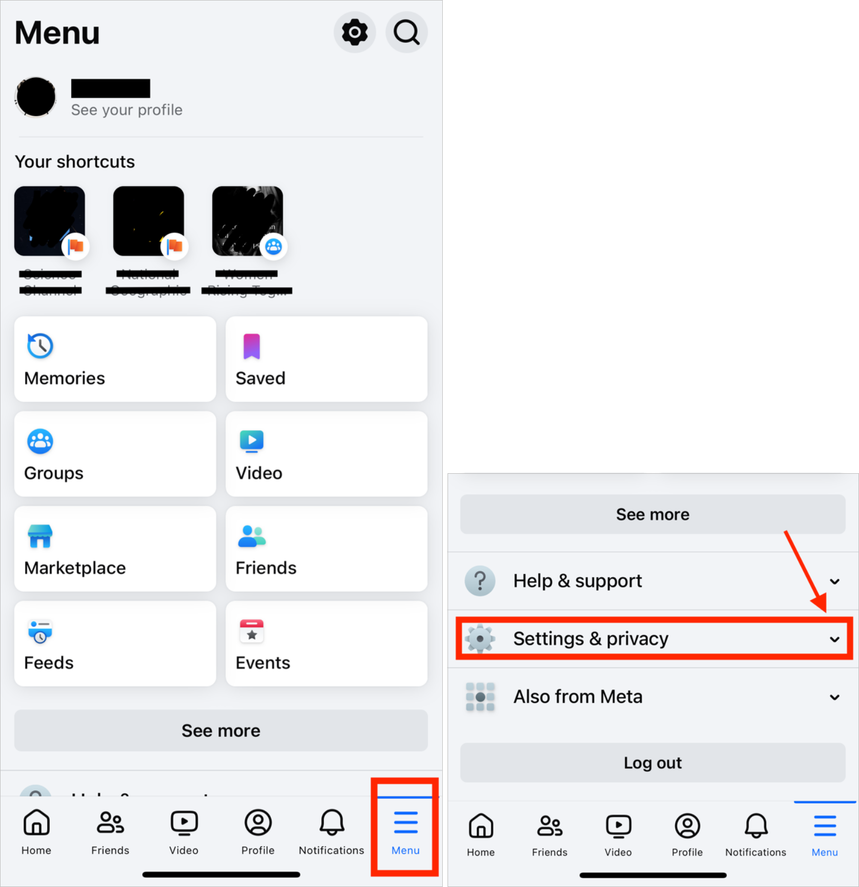

Then click on **Settings**. This will open another page. Click on **See
more in Accounts Center.**

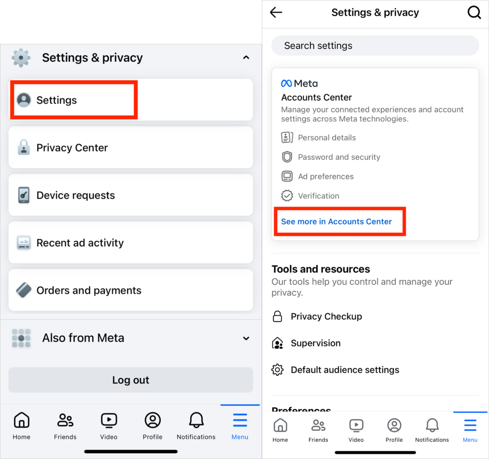

Once you reach the Accounts Center, click on **Your information and
permissions**.

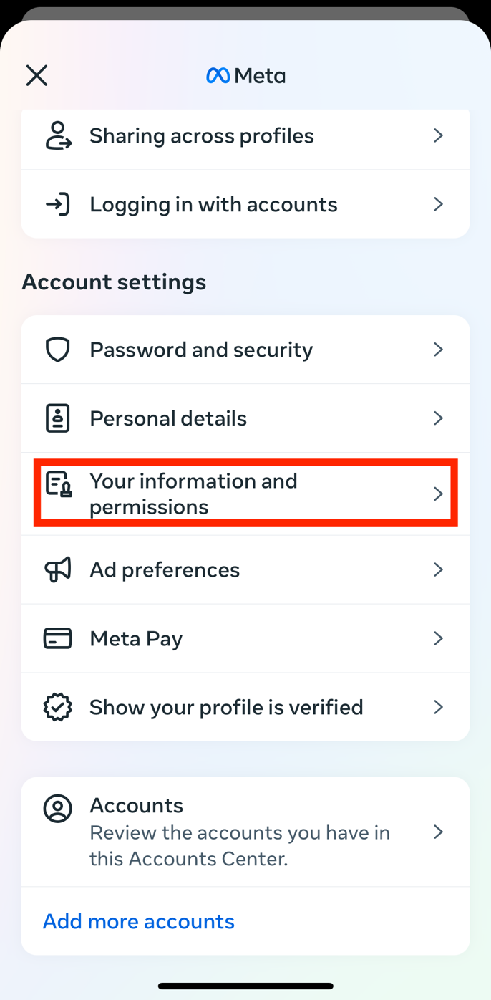

## 3. Click Download or transfer information

Click on **Download your information**, then on **Download or transfer
your information**.

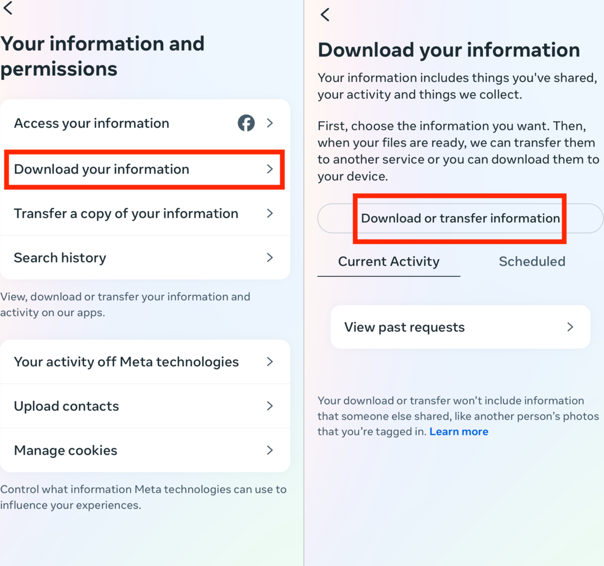

## 4. Select the amount of information you would like to download

You will be asked how much information you would like to download. Click
on **Available information**.

Then click on **Download to device**.

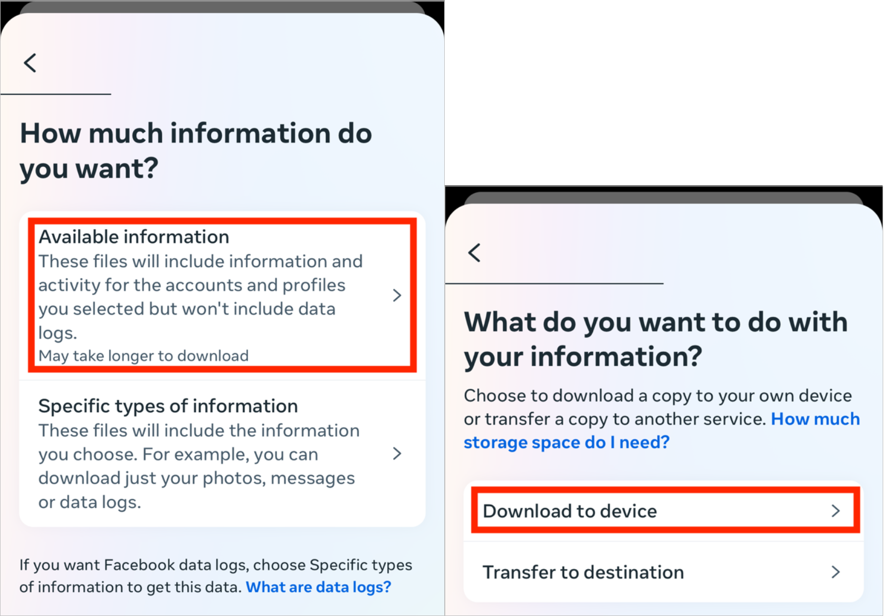

## 5. Choose your file options

You will then have to specify the date range, who to notify, the format,
and the media quality. Select the following:

- Date range: All time
- Notify: \[enter your email\]
- Format: JSON
- Media quality: Medium

Then click on **Create files**.

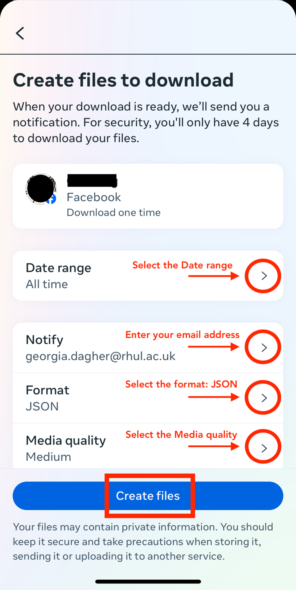

Once you click on Create files, the following page will appear:

## 6. Check your email for the download link

You will then receive an email from Meta
[`notification@facebookmail.com`] with the download link. Make sure that
you are signed in to the email you entered in the previous step. If you
have not received the email within a half an hour, make sure to check your junk mail folder.

In the email, click **download your information**. You will have to do
this within four days of requesting the information, otherwise you will
have to request a new download.

Once you click on download your information, your device will ask you
which browser to open the file in.

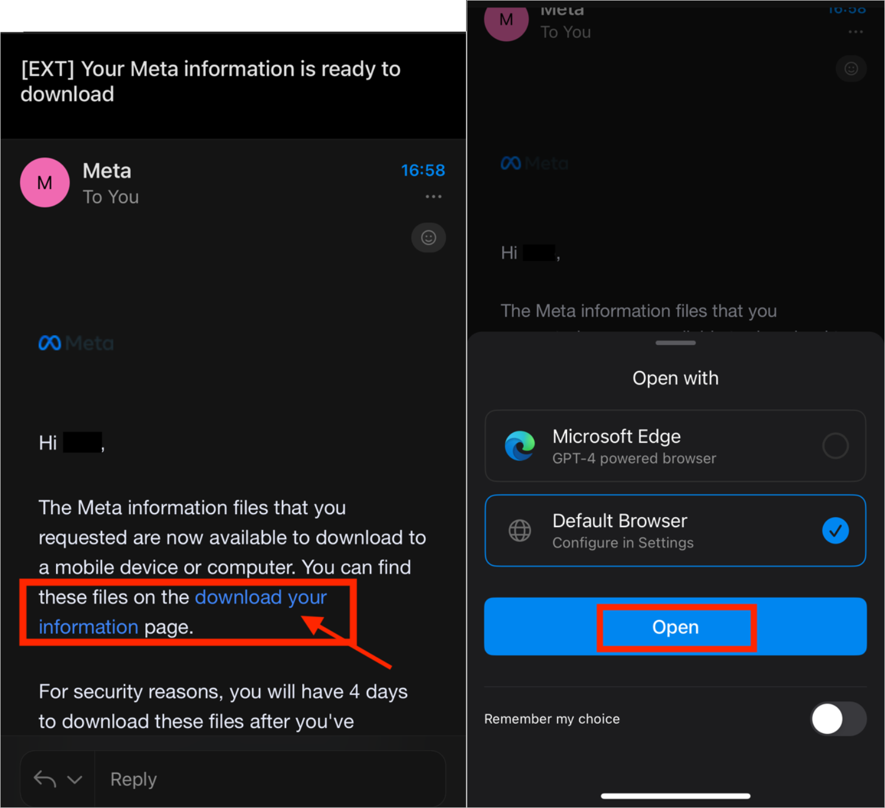

## 7. Start downloading the information to your device

Then open the Facebook app again, and click on **Download**.

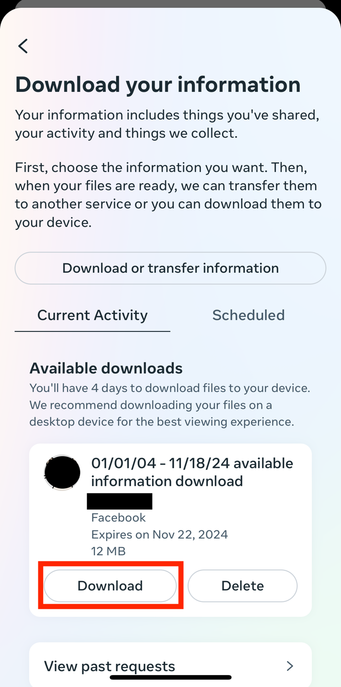

You will be asked to re-enter your Facebook password. Enter your
password and click on **Continue**.

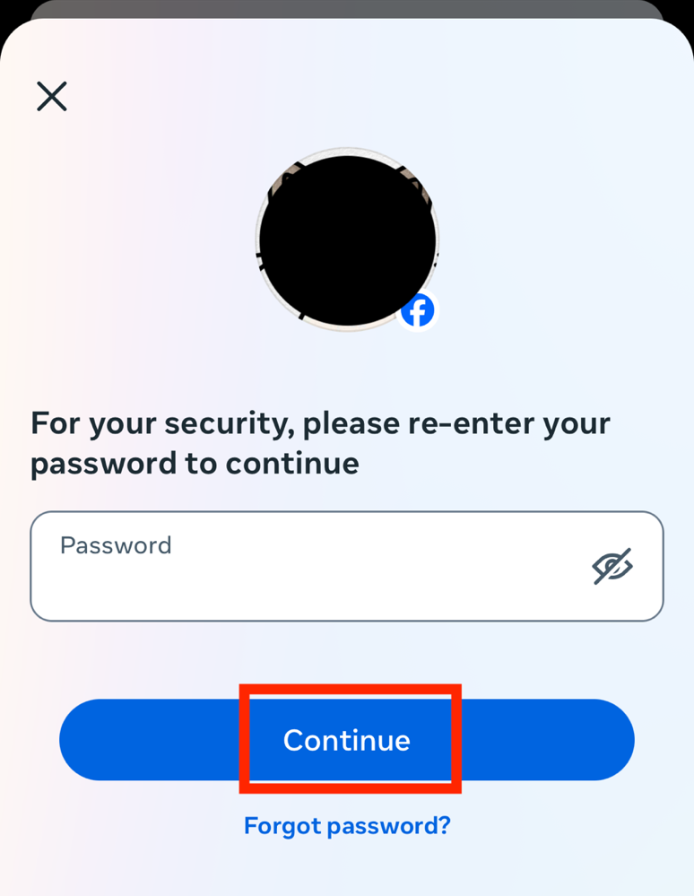

Once you click on Continue, your device browser will automatically open.
Click on **Download**.

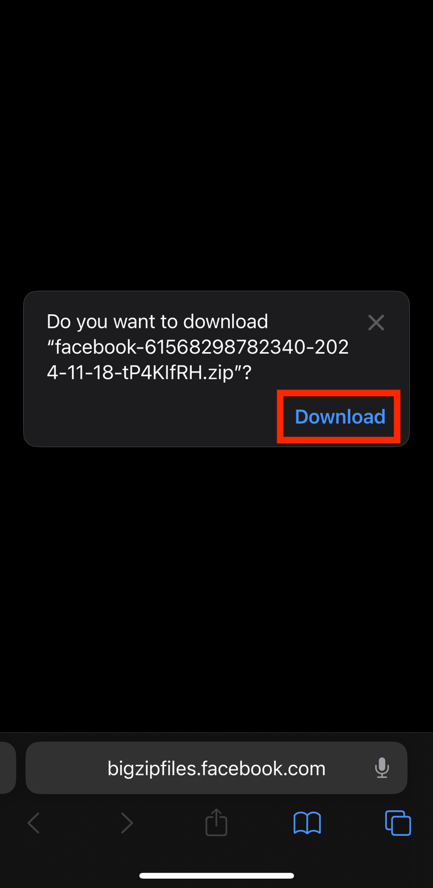

In the browser, click on **Create files**.

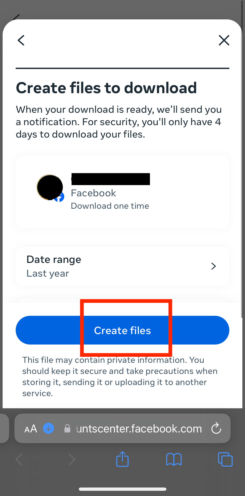

Your download will then start. You can click on the blue arrow on the
bottom left, and then Downloads, to make sure that the process has
started.

The downloaded information will be a ZIP file. In order to locate it on
your device, open your Downloads folder on your device. You can find
this through your device's search bar, or by clicking directly on the
ZIP file from your browser.

The Downloads folder should look like this:

