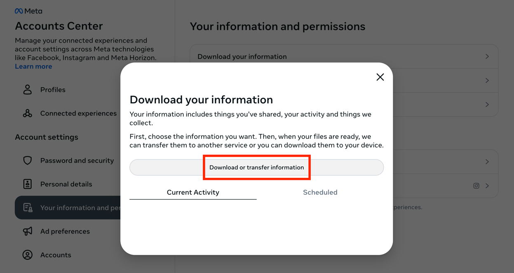
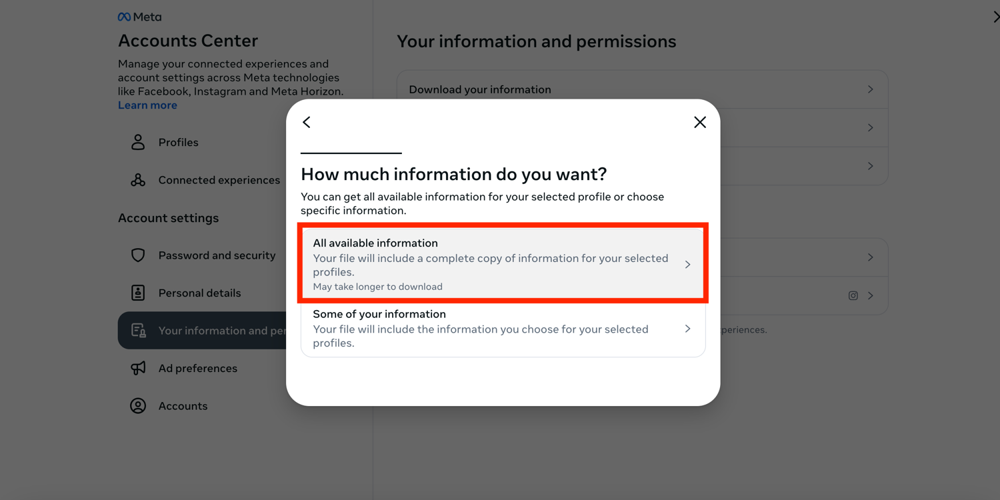
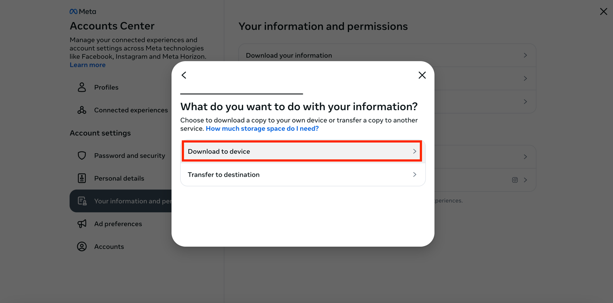
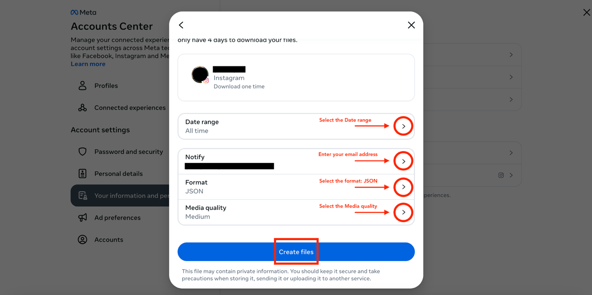
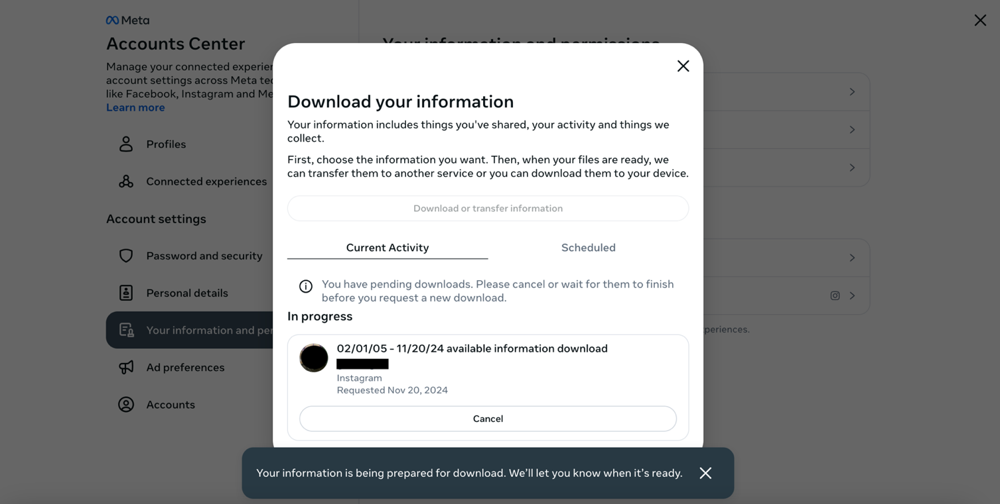
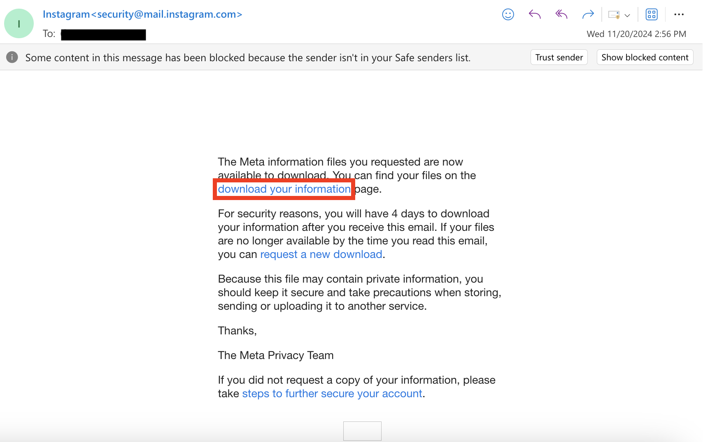
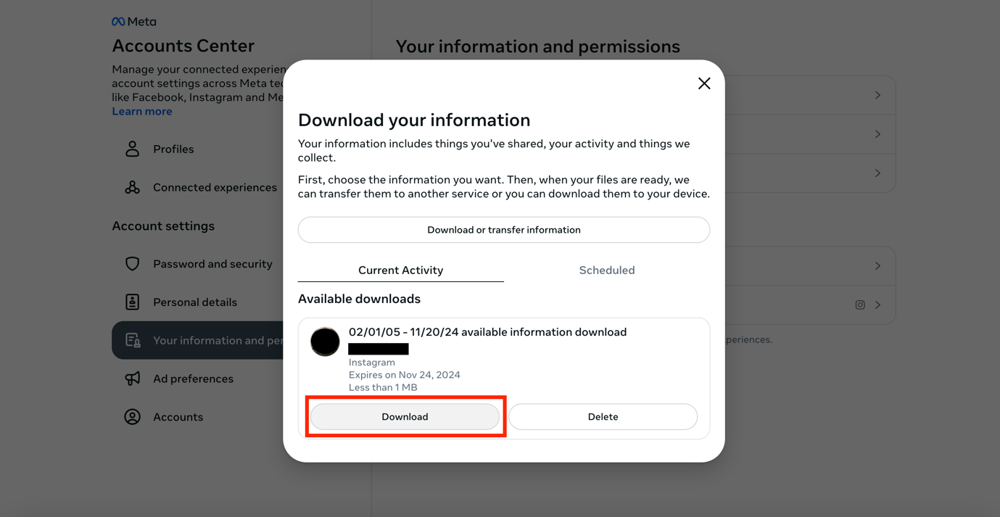

Device: **Browser** \| [App](instagram_app)

## 1. Log in to Instagram and open the Download your information page

Open Instagram and log into your account: [https://www.instagram.com/](https://www.instagram.com/)

Once you sign in, you will need to find the Download your information
page on your Accounts Center. You can do this directly by clicking on:
[https://accountscenter.instagram.com/info_and_permissions/dyi/?entry_point=deeplink_screen>](https://accountscenter.instagram.com/info_and_permissions/dyi/?entry_point=deeplink_screen>)

## 2. Click on **Download or transfer information**.

Once you click on Download your information, the following page will
appear:

Click on **Download or transfer information**.

## 3. Select the amount of information you would like to download

Click on **Available information**.

Once you click on Available information, select **Download to device**.

## 4. Choose your file options

The following will appear to select your file options:

Select the **Date range**: All time \[_note: Date range can be
customised_\]

- Select who to **notify**: \[email address\]
- Select the **format**: JSON
- Select the **media quality**: Medium \[_other options: Low/High_\]
- Then click on **Create files**.

Once you click on **Create files**, this will appear:

## 5. Check your email for the download link

Instagram \[security@mail.instagram.com\] will send you an email with a
download link within [30 minutes \[*note: it took 15 with me with the
file options I selected*]{.mark}\]. Make sure that you are signed in to
the email you entered in the previous step. If you have not received the
email within a few hours, make sure to check your junk mail folder.

In the email, click **download your information**. You will have to do
this within four days of requesting the information, otherwise you will
have to request a new download.

## 6. Start downloading the information to your device

Once you click on the link above, the following page will appear:

Click on **Download** on the bottom left.

Note that you might be asked to re-enter your Instagram password for
security reasons. If so, enter your password and click on Submit.

The file will start downloading on your device.

## 7. Locate the downloaded file on your device

The information will be downloaded to your device as a ZIP file and will
be saved on your device in the Downloads folder.
