Device: [Browser](instagram) \| **App**

## 1. Sign in on the Instagram app

Open the Instagram app and sign in to your account.

## 2. Open the Accounts Center

First click on your profile on the bottom right of the screen. Then
click on the Settings and activity button on the top right.

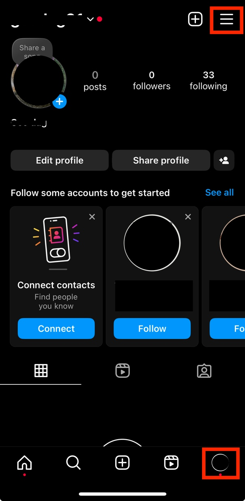

Then click on Accounts Center and Your information and permissions.

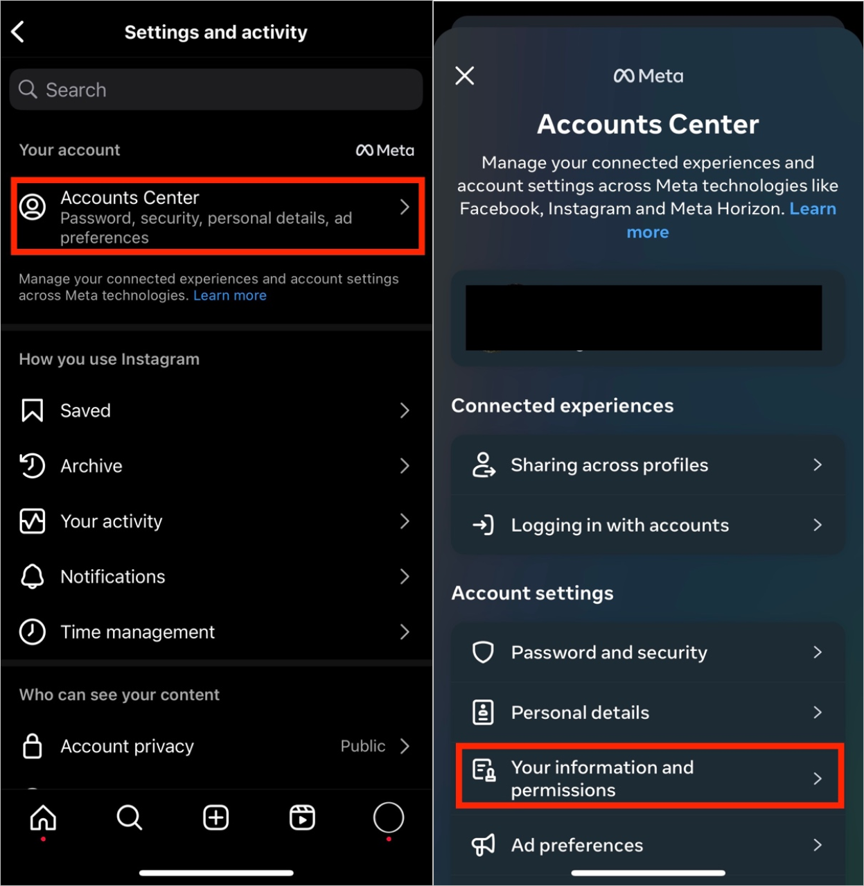

## 3. Request your information

Click on Download your information, then on Download or transfer your
information.

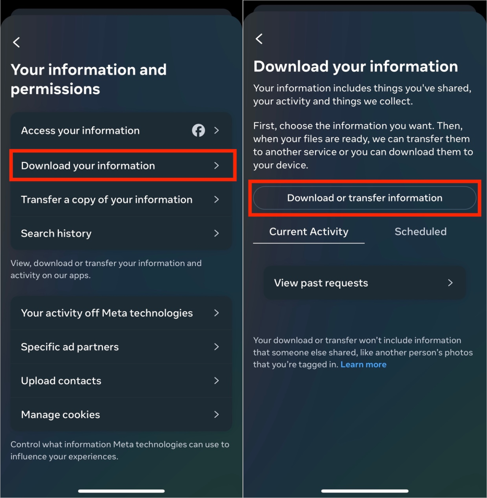

You will be asked how much information you would like to download. Click
on Available information.

Then click on Download to device.

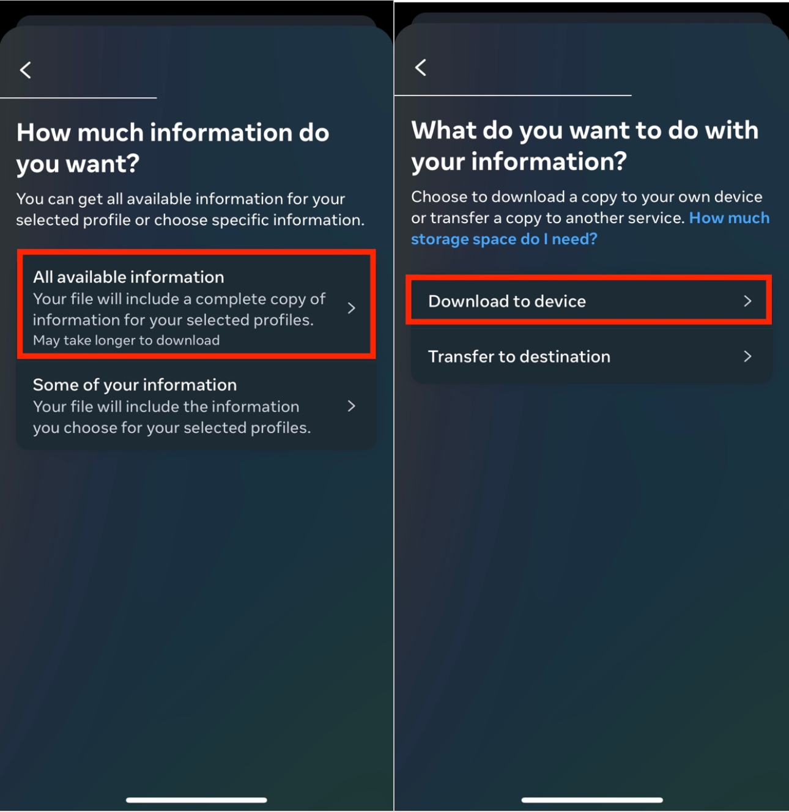

You will then have to specify the date range, who to notify, the format,
and the media quality. Select the following:

- Date range: All time
- Notify: \[enter your email\]
- Format: JSON
- Media quality: Medium

Then click on **Create files**.

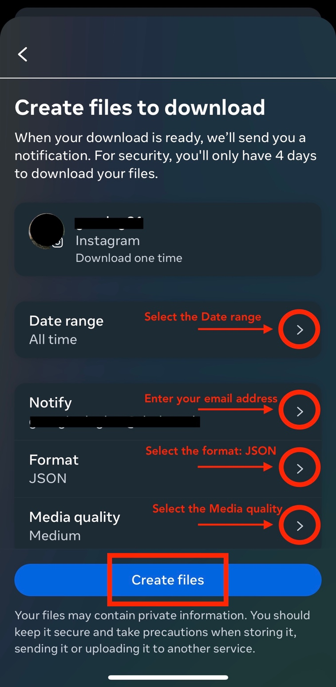

Once you click on Create files, the following page will appear:

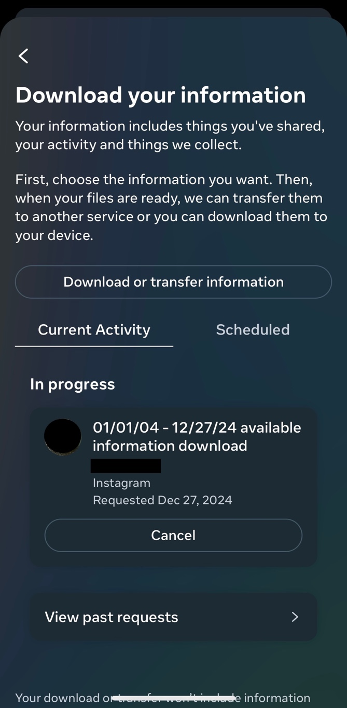

## 4. Download your information

You will then receive an email from Instagram
(`seccurity@mail.instagram.com`) with the download link. Make sure that
you are signed in to the email you entered in the previous step. If you
have not received the email within a few hours, make sure to check your
junk mail folder.

In the email, click download your information. You will have to do this
within four days of requesting the information, otherwise you will have
to request a new download.

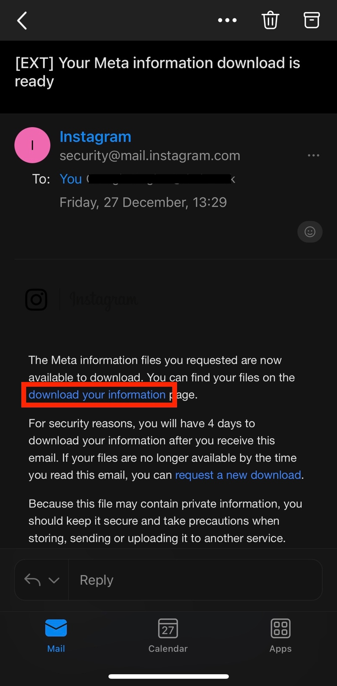

Then open the Instagram app again, and click on Download.

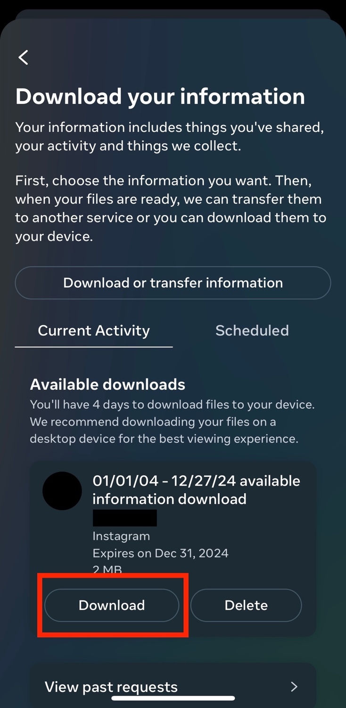

You will be asked to re-enter your Instagram password. Enter your
password and click on Continue.

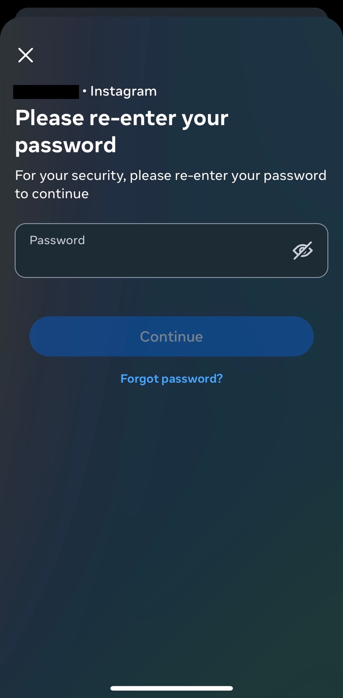

Once you click on Continue, your device browser will automatically open.
Click on Download.

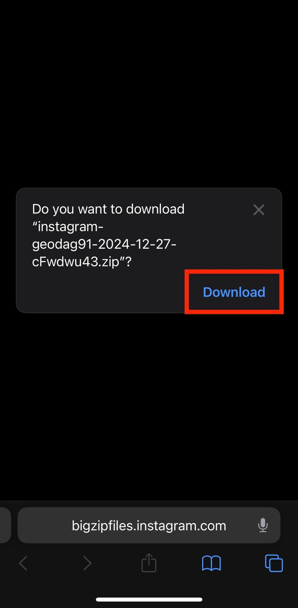

The downloaded information will be a ZIP file. In order to locate it on
your device, open your Downloads folder on your device. You can find
this through your device's search bar, or by clicking directly on the
ZIP file from your browser.

The Downloads folder should look like this:

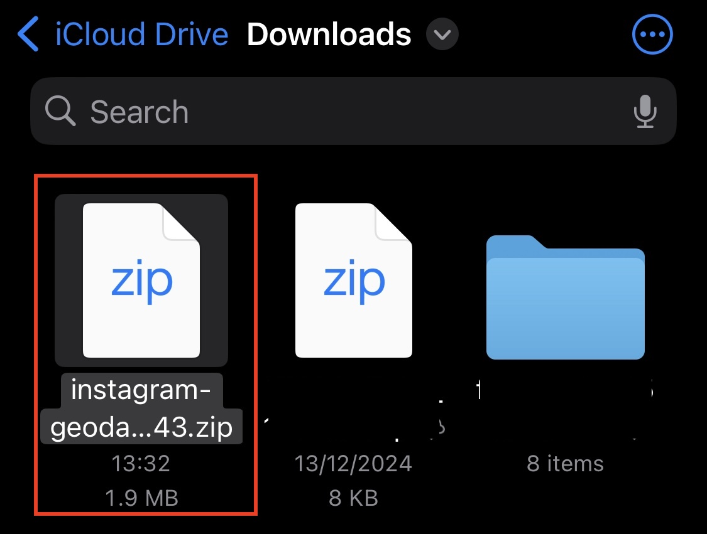
