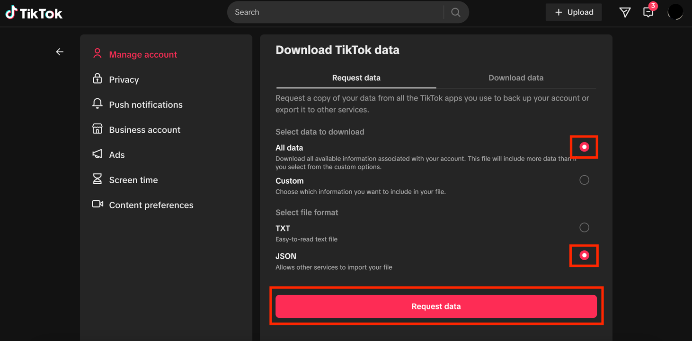
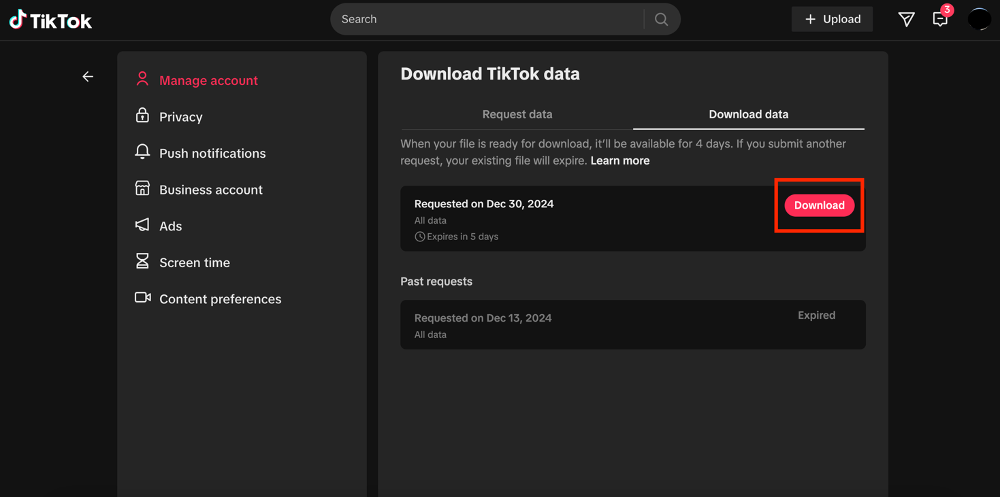
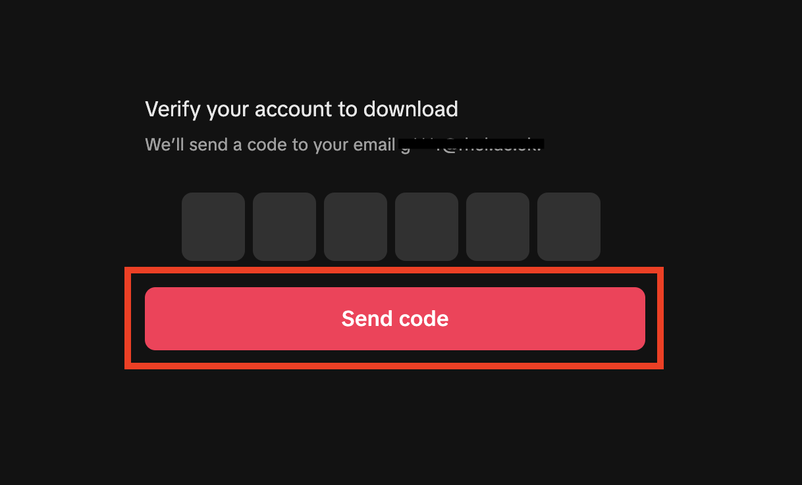
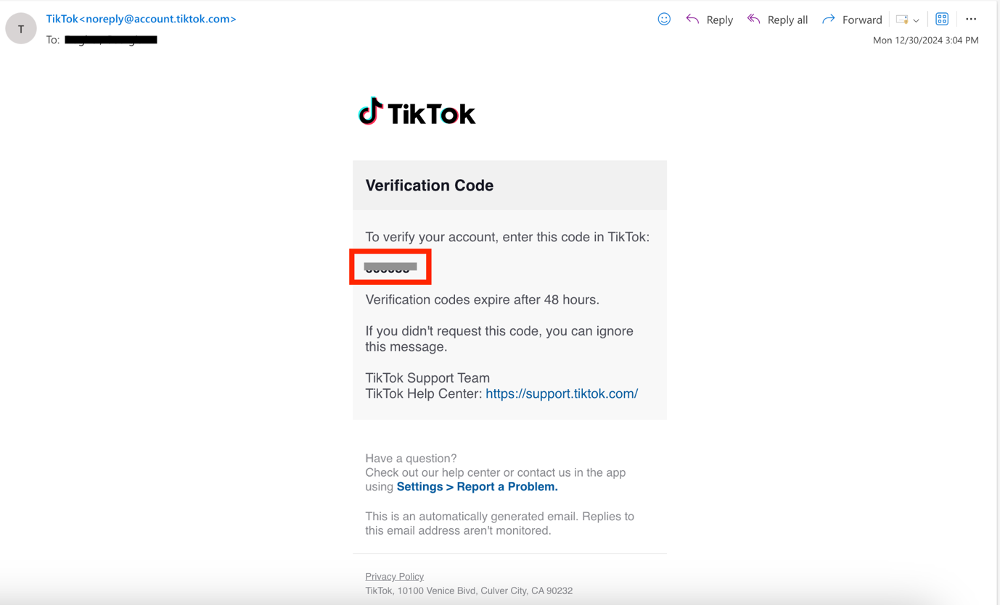

Device: **Browser** \| [App](tiktok_app)

Open <https://www.tiktok.com/> and sign in to your account.

Then click on <https://www.tiktok.com/setting/download-your-data>.

You will need to specify the amount and format of the data. Select All
data under data to download, and select JSON under file format.

Then click on Request data.

Then click on Download.

You will need to verify your account before the downloading process can
start. To do so, TikTok will send you a verification code by email.

Click on Send code.

Open your inbox and copy the verification code. The email will be sent
by noreply@account.tiktok.com.

If you have not received the email within a few hours, make sure to
check your junk mail folder.

Go back to your browser and enter the verification code. Your download
will then start.

The file will be downloaded to your device as a ZIP file and will be
saved on your device in the Downloads folder.
