Device: [Browser](instagram) \| **App**

## 1. Open the TikTok app and click on the Menu

Open the TikTok app, click on Profile on the bottom right of the page,
then click on Menu ☰ on the top right.

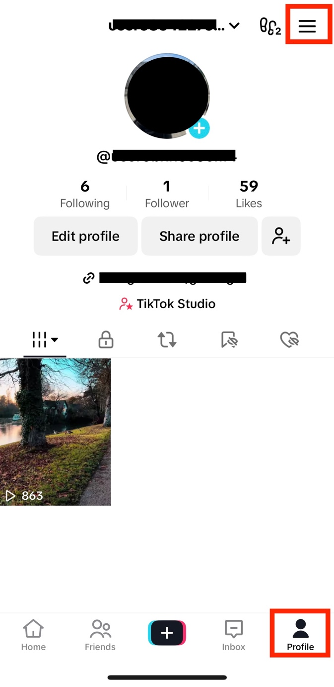

## 2. Click on Settings and privacy

Once you click on Menu, click on Settings and privacy.

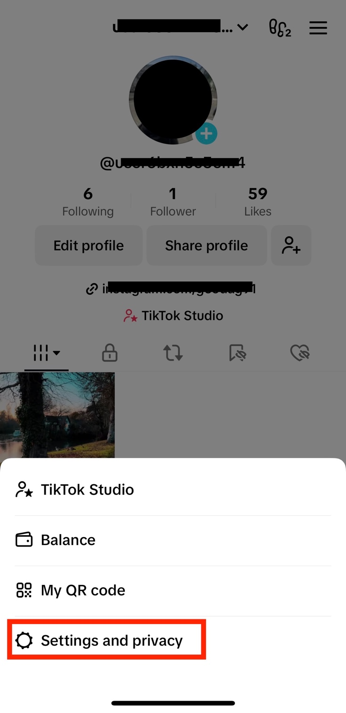

## 3. Click on Account

Then click on Account.

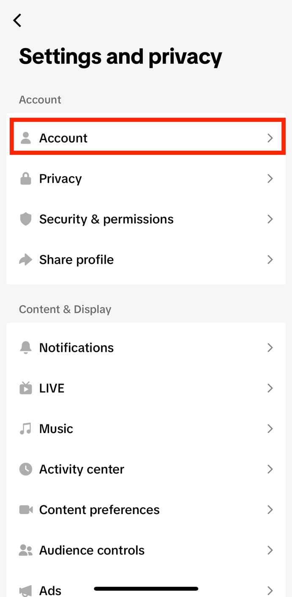

## 4. Click on Download your data

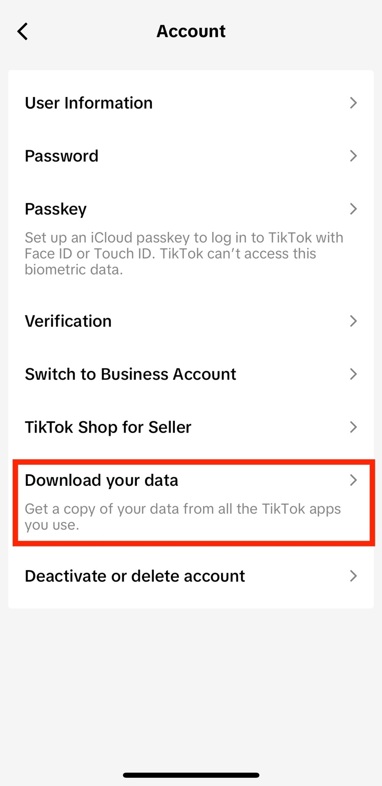

## 5. Select the file format

Once you click on Download your data, the following page will open.

Click on Select file format, then change the format to JSON.

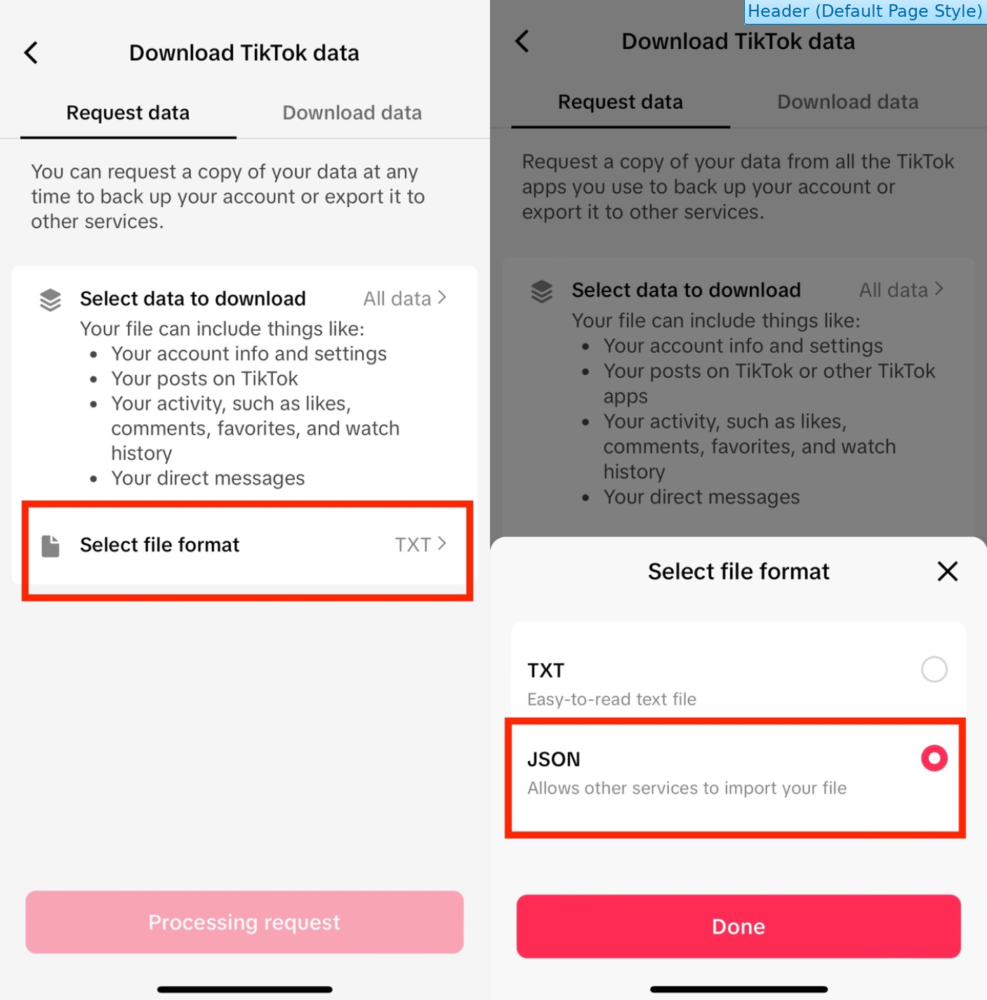

## 6. Request data

Click on Request data.

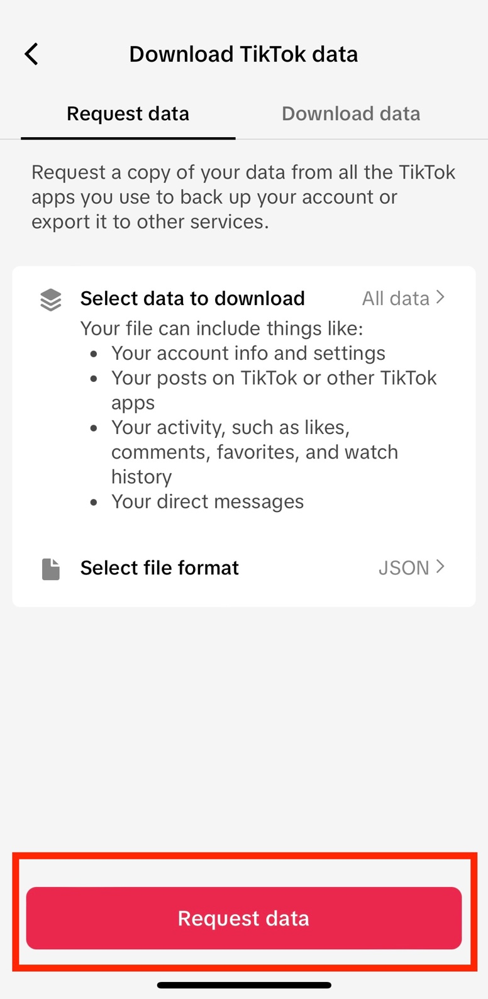

## 7. Verify your account

First click on Download.

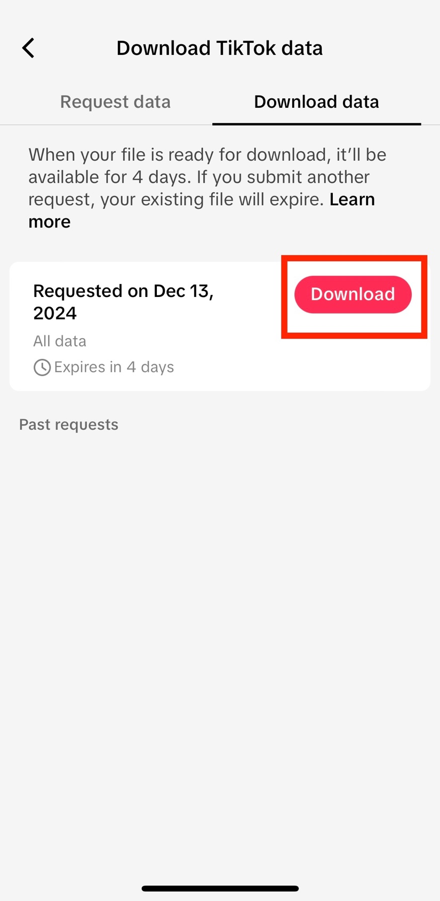

You will need to verify your TikTok account through a verification code
sent to your email.

Click on Send code.

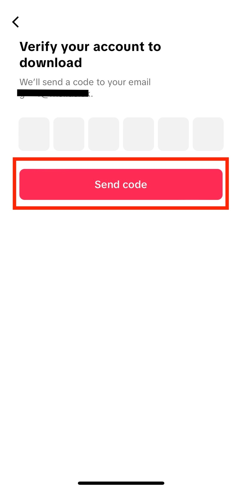

Open your inbox and copy the verification code. The email will be sent
by register@account.tiktok.com.

If you have not received the email within a few hours, make sure to
check your junk mail folder.

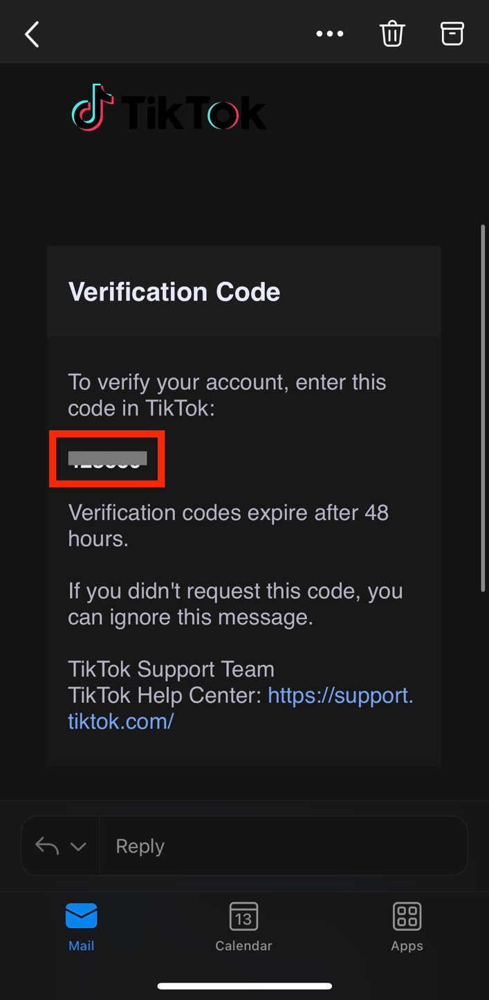

Go back to the TikTok app and enter the verification code.

## 8. Download the data

Once you enter the verification code, your device browser will
automatically open. Click on Download.

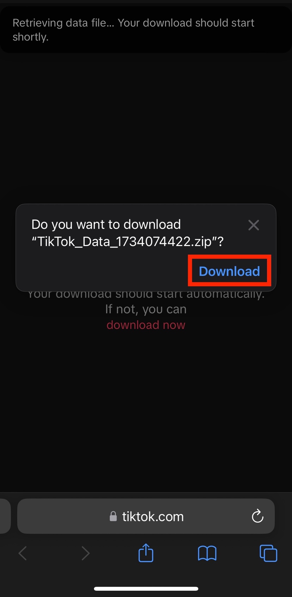

Your download will then start. You can click on the blue arrow on the
bottom left, and then Downloads, to make sure that the process has
started.

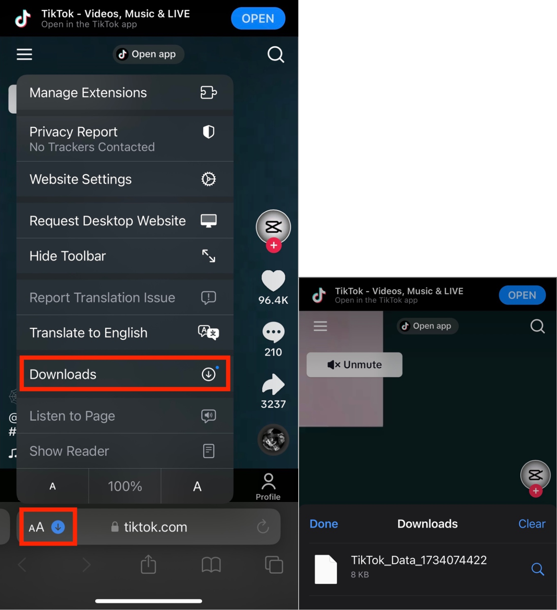

The downloaded information will be a ZIP file. In order to locate it on
your device, open your Downloads folder on your device. You can find
this through your device’s search bar, or by clicking directly on the
ZIP file from your browser.

The Downloads folder should look like this:

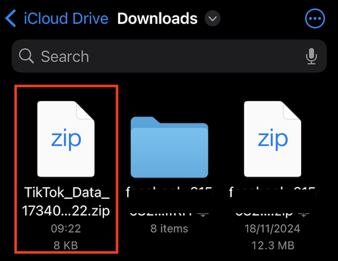
