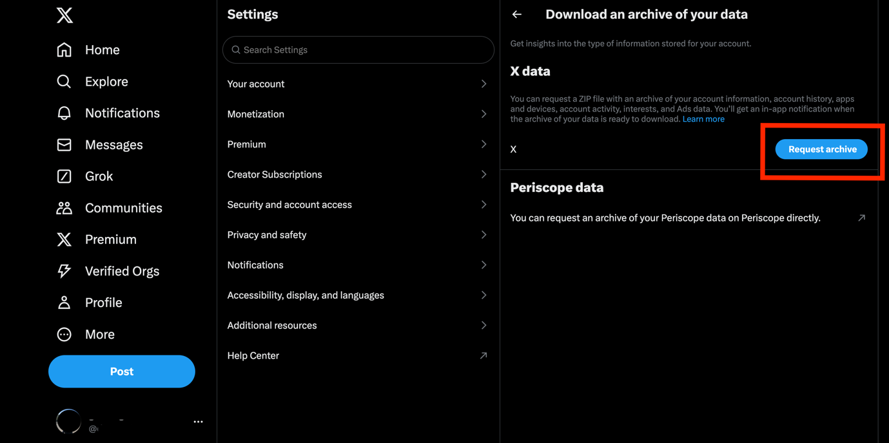
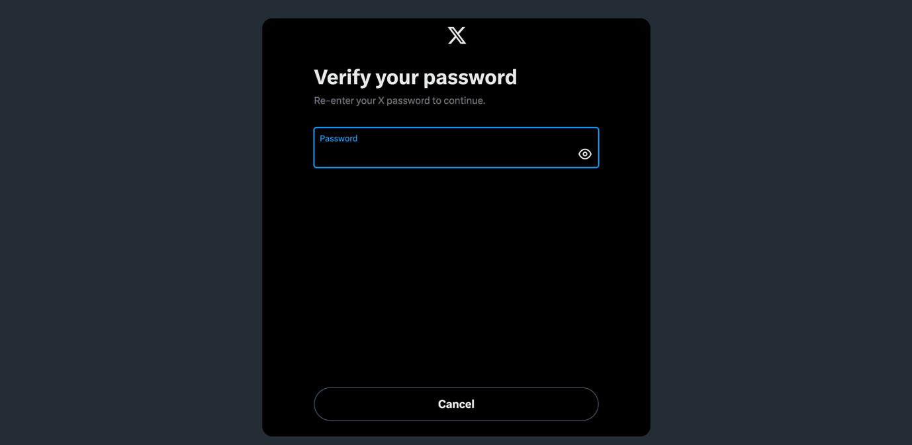
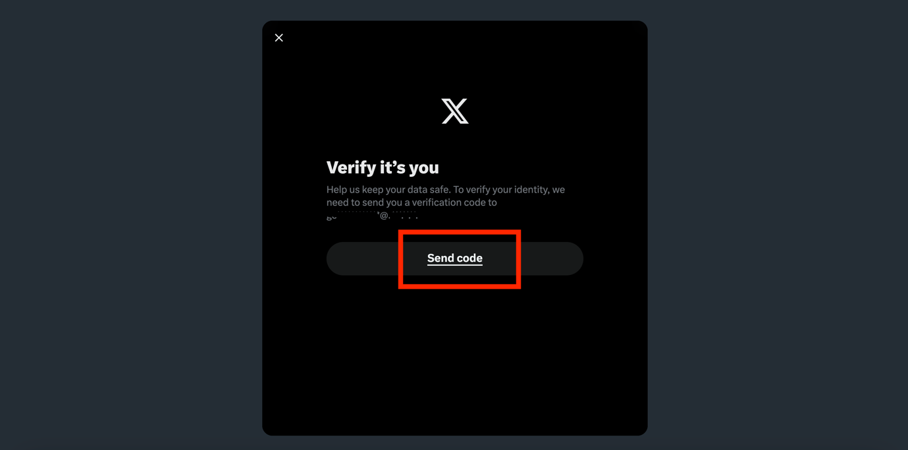
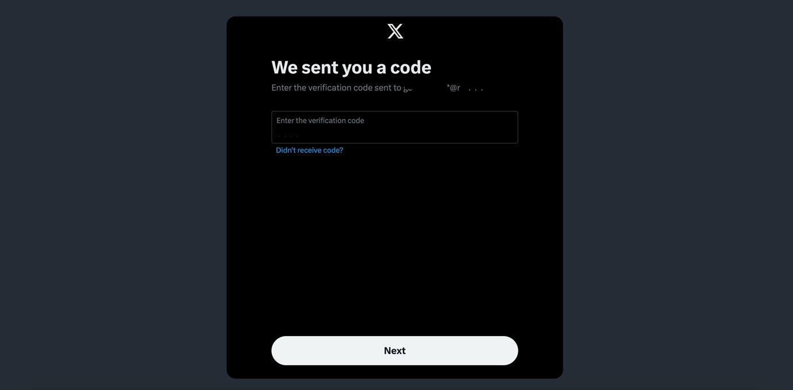
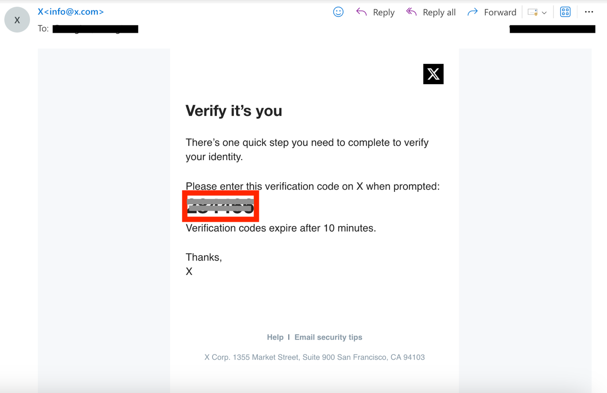
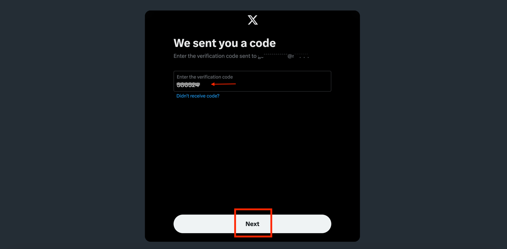
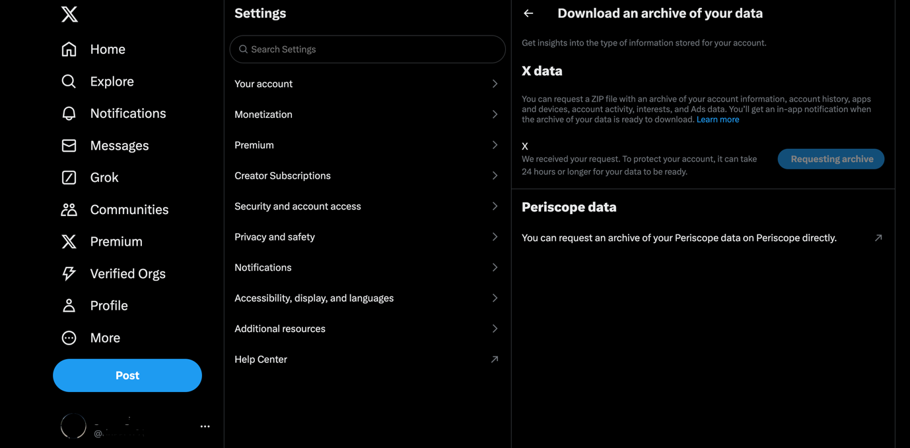
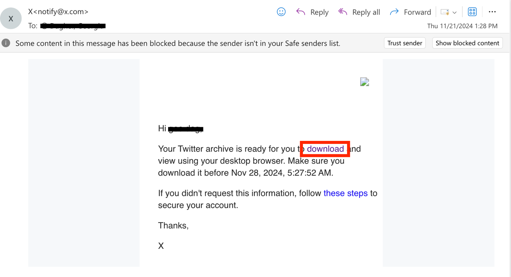
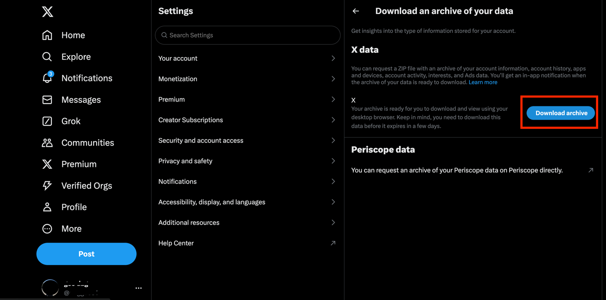

## 1. Sign in to your X account

Go to [https://x.com](https://x.com) and sign into your account.

## 2. Go to the Download an archive of your data page and click on Request archive

Click on the following link to directly reach the Download an archive of
your data page: [https://x.com/settings/download_your_data](https://x.com/settings/download_your_data).

Then click on Request archive.

## 3. Verify your identity

You will have to verify your identity in two steps.

First, once you click on Request archive (previous step), the following
page will appear and you will have to re-enter your X password.

Once you verify your password, the following page will appear, where you
will need to enter a verification code.

This code will be sent to you via email by X (<info@x.com>). This will
be on the email you initially used when you signed up on X.

To request the code, click on Send code.

The following page will appear, asking you to enter the verification
code.

Open your email inbox, and if you do not receive the email from X within
a few minutes, make sure to check your Junk Email folder.

In the email, copy the verification code.

Go back to X and enter the verification code, then click on Next. Note
that the verification code is only valid for 10 minutes. If you do not
enter it within 10 minutes, you will have to request a new code.

Once you enter the code, X will receive your Request to download your
archive. The following page will appear.

## 4. Check your email for the download link and download the data

You will then have to wait for X to notify you when the archive of your
data is ready to download. X will notify you with an in-app notification
as well as via email.

Note that this can take 24 hours or longer.

Once you receive the email, click on download.

This will open X on your browser again. Click on Download archive. This
will start the download process.

## 5. Locate the downloaded file on your device

The information will be downloaded to your device as a ZIP file and will
be saved on your device in the Downloads folder.
