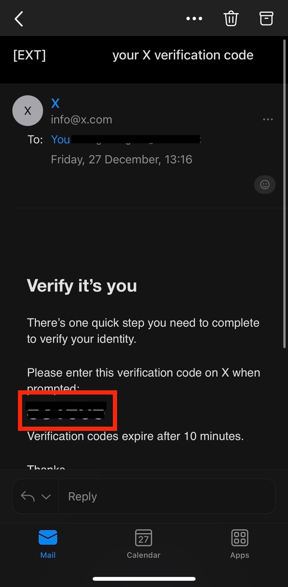
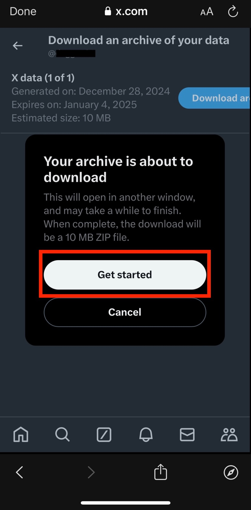

Device: [Browser](x) \| **App**

Open the X app and sign in to your account. Then click on your profile
on the top left of the screen.

Click on Settings and privacy.

Then click on Your account.

Click on Download an archive of your data.

Once you click on Download an archive of your data, X will need you to
verify your identity. X will send you a verification code by email.

Click on Send code.

Open your email inbox, and if you do not receive the email from X
(<info@x.com>) within a few minutes, make sure to check your Junk Email
folder.

In the email, copy the verification code.

Go back to X and enter the verification code. Then click on Next.

Click on Request archive.

You will then have to wait for X to notify you when the archive of your
data is ready to download. X will notify you with an in-app notification
as well as via email.

Note that this can take 24 hours or longer.

Once you receive the email, click on download.

Once you click on download, the page will open automatically on the X
app or on your browser. Click on Download archive.

Then click on Get started.

The archive will be downloaded as a ZIP file. In order to locate it on
your device, open your Downloads folder on your device. You can find
this through your device's search bar.
