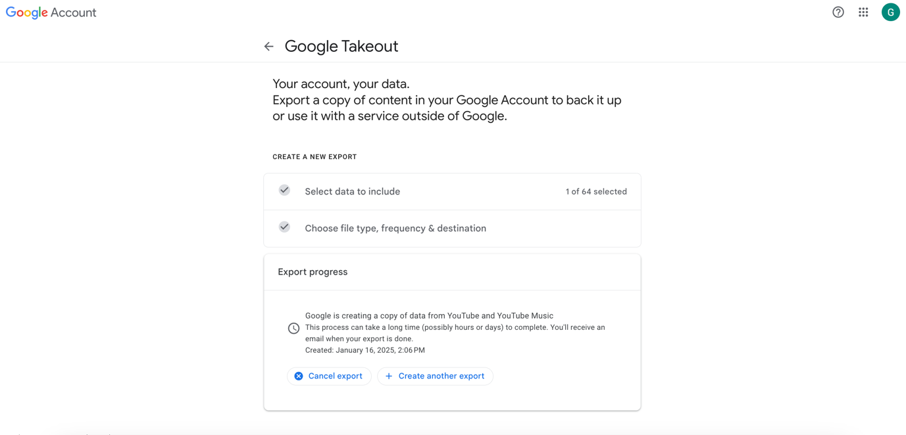

Device: **Browser** \| [App](youtube_app)

Sign in to your Google account, then go to the Google takeout page:
<https://takeout.google.com/>.

To download your YouTube data only, click on Deselect all.

Then scroll down to find the YouTube check, and click on Next steps.

The following will appear:

Select the following options:

- Transfer to: Send download link via email
- Frequency: Export once
- File type: .zip
- Size: 2 GB

<!-- Note: options are 1; 2; 4; 10 – but files larger than 2 GB are split into multiple files -->

Then click on Create export.

The following page will appear:

You will receive a confirmation email from Google
(no-reply@accounts.google.com), which should look like this:

You will then have to wait for your data to be ready and for Google to
send you the download link. Note that this could take up to several
days.

Once you receive the email (from noreply@google.com), click on Download
your files.

To continue, you will have to enter your password.

Enter your password, then click on Next.

The following page will appear, and the download should start
automatically.

The data will be downloaded as a .zip file and will be saved in your
Downloads folder.
