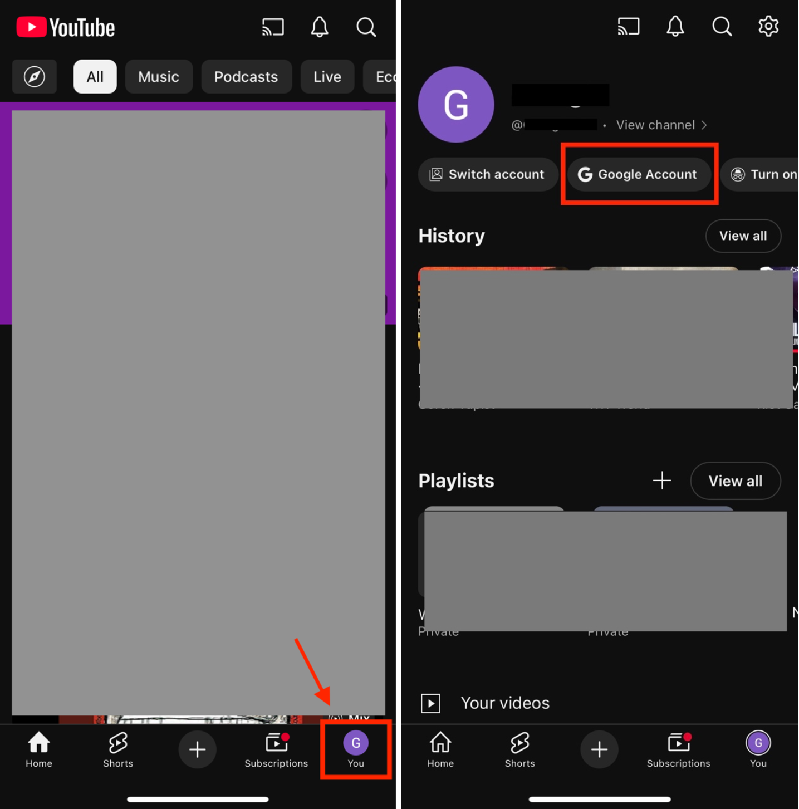
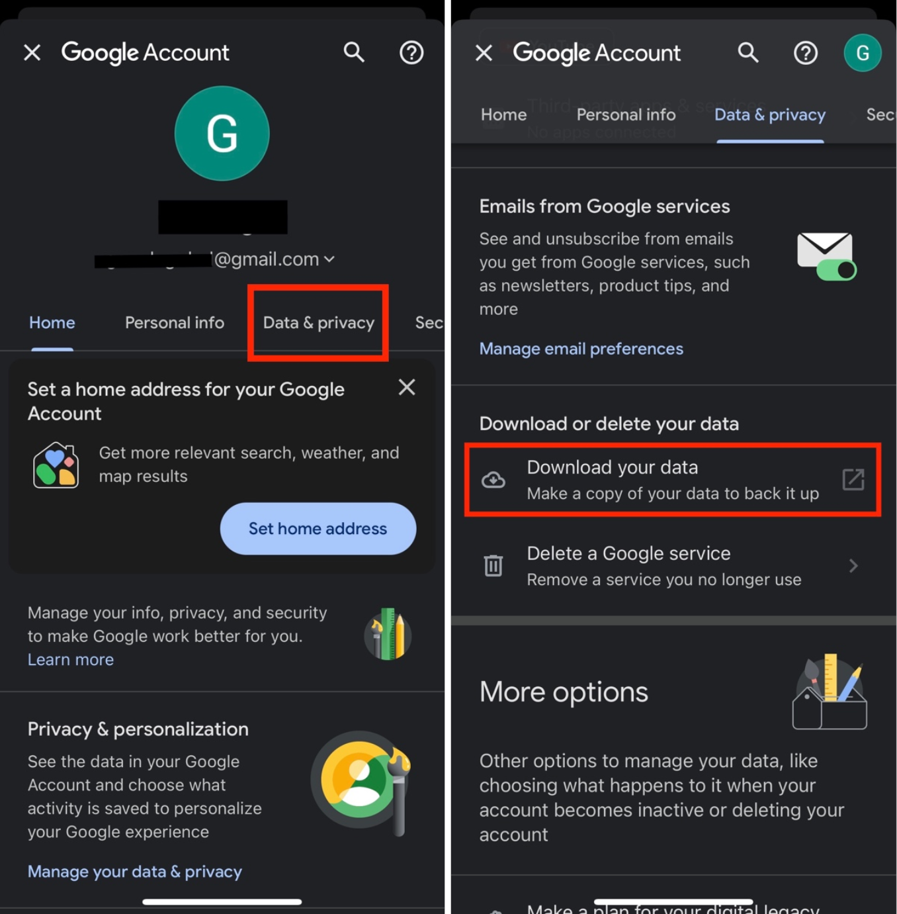
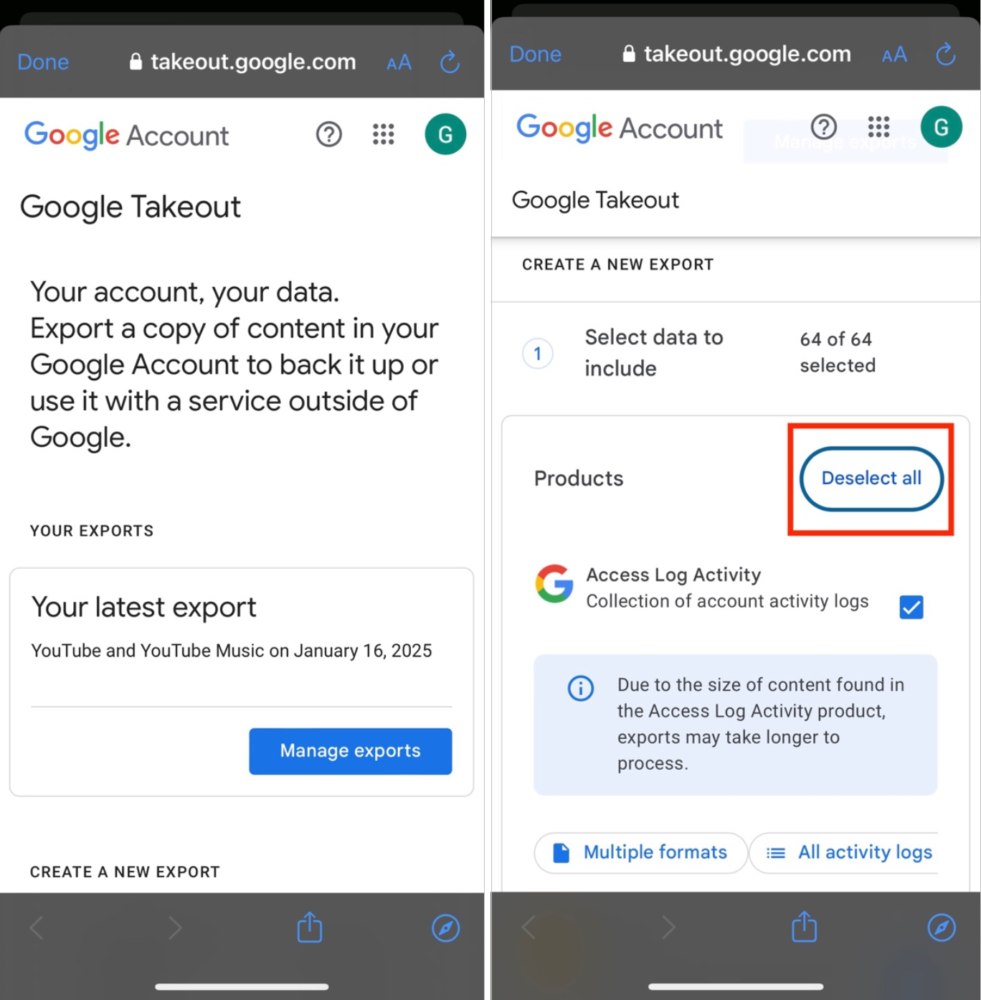
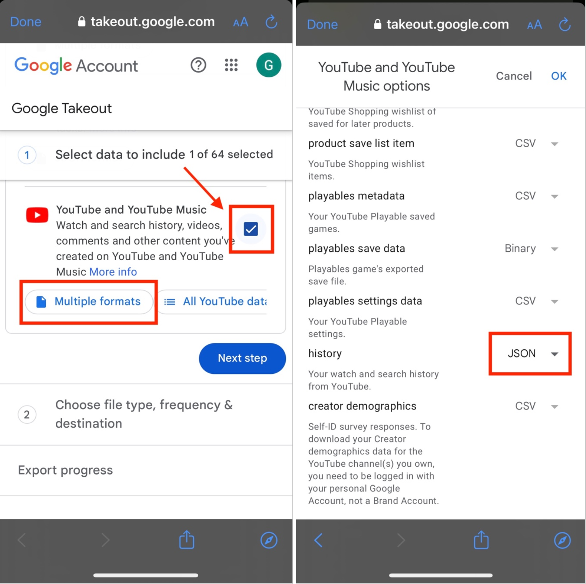
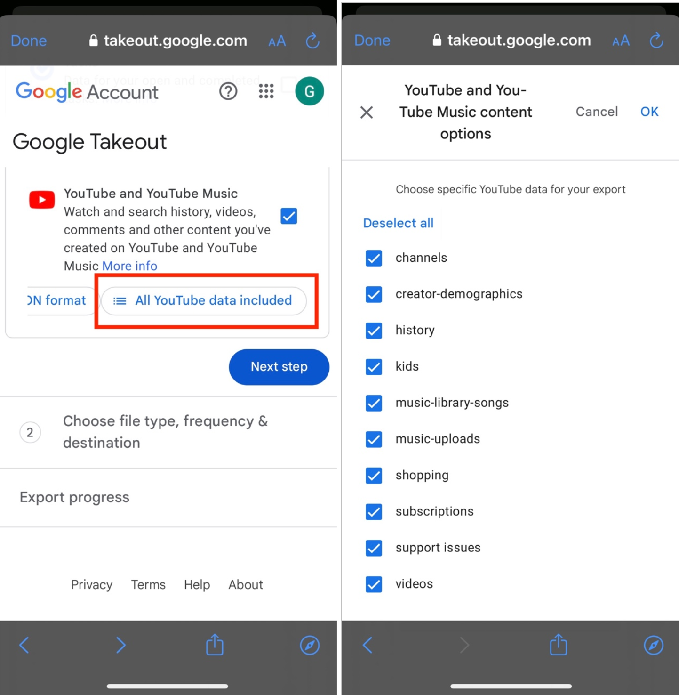
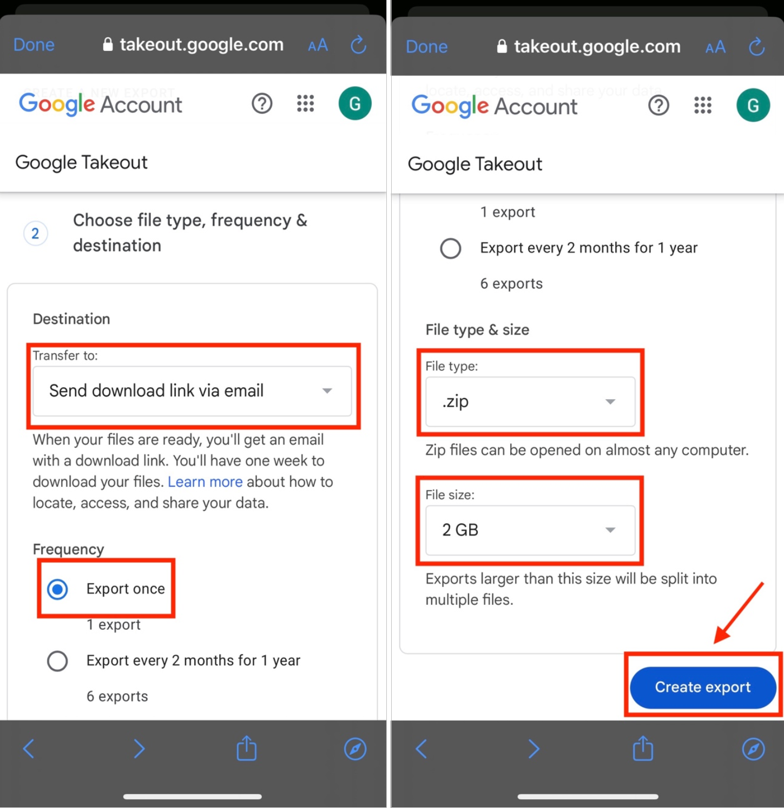
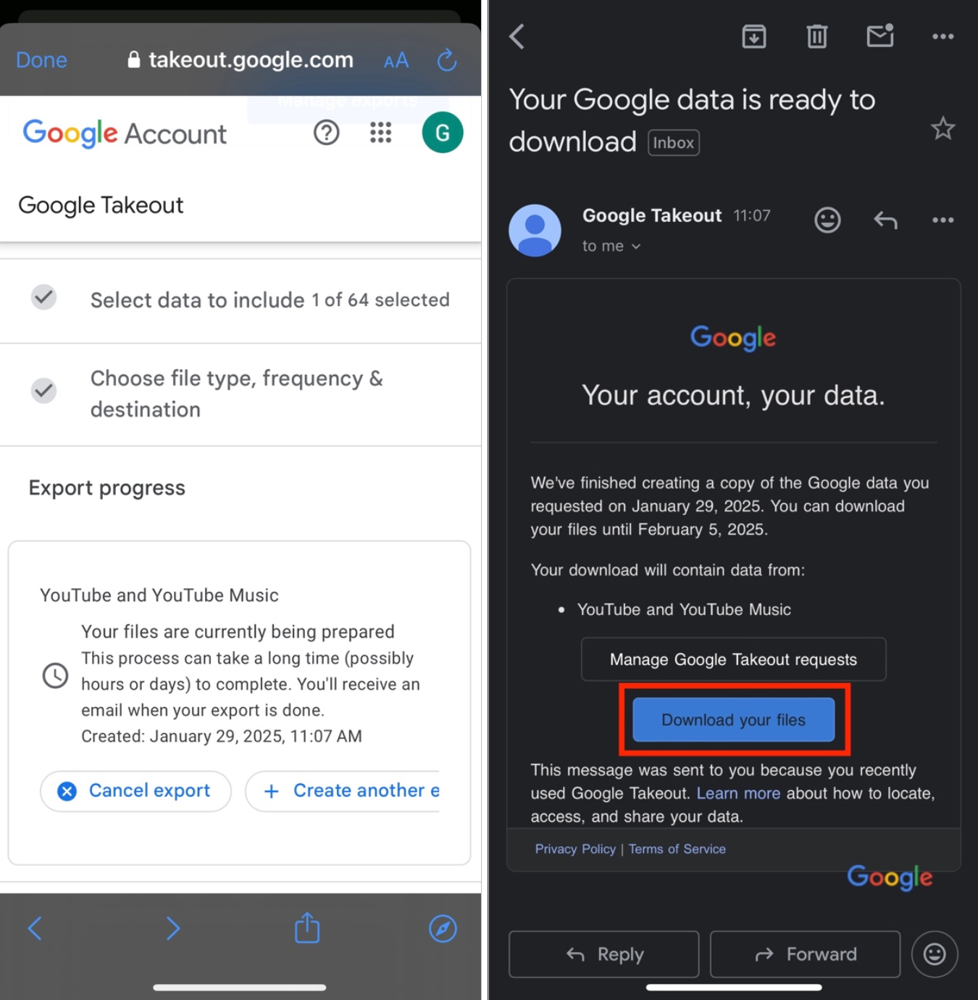
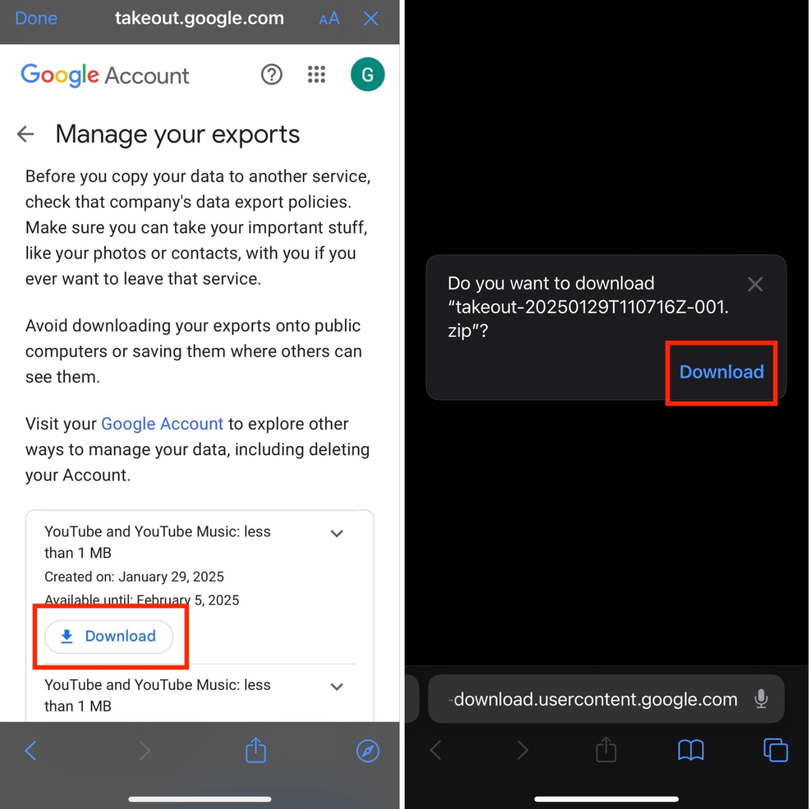
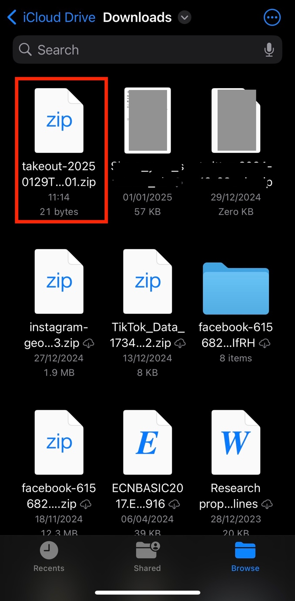

Device: [Browser](youtube) \| **App**

Open the YouTube app on your phone then click on your profile picture at
the bottom right of the screen. Then click on **Google Account** at the
top of the page.

The following page will open. Click on **Data & privacy**.

Then scroll down and click on **Download your data**.

The Google Takeout page will appear. Scroll down and click on **Deselect
all**, as we are only requesting your YouTube data.

Next, you will have to select the amount and type of data you would like
to download. Scroll down and select **YouTube**.

Then click on **Multiple formats**. Once you click on Multiple formats,
scroll down and select the format for the **history** file. It will give
you two options: HTML or JSON. Select **JSON**.

Then click on OK at the top of the page.

The previous page will appear again. Make sure that
the **All YouTube data included** is selected.

<!-- Note: This might need to be changed, depending on
the data you will need for the project_. Would change to: Or click on
All YouTube data included and select the type of data – and then give
instructions for which data to select) -->

Click on OK at the top of the page then click on **Next step**. You will
then need to choose the file type, frequency, and destination.

Select the following:

- **Transfer to**: Send download link via email.
- **Frequency**: Export once.
- **File type**: .zip.
- **File size**: 2 GB.

Then click on **Create export**.

The following page will appear, and you will need to wait for your data
to be ready for download.

Once the data is ready, you will receive an email from Google Takeout
(<noreply@google.com>). Click on **Download your files**.

Once you click on Download your files, you might need to sign in again.
If so, enter your gmail account and password.

The following page will appear, and click on **Download**.

The file will then be downloaded on your device. Once the download is
complete, it will be saved on your device in the Downloads folder, which
will look like this:

